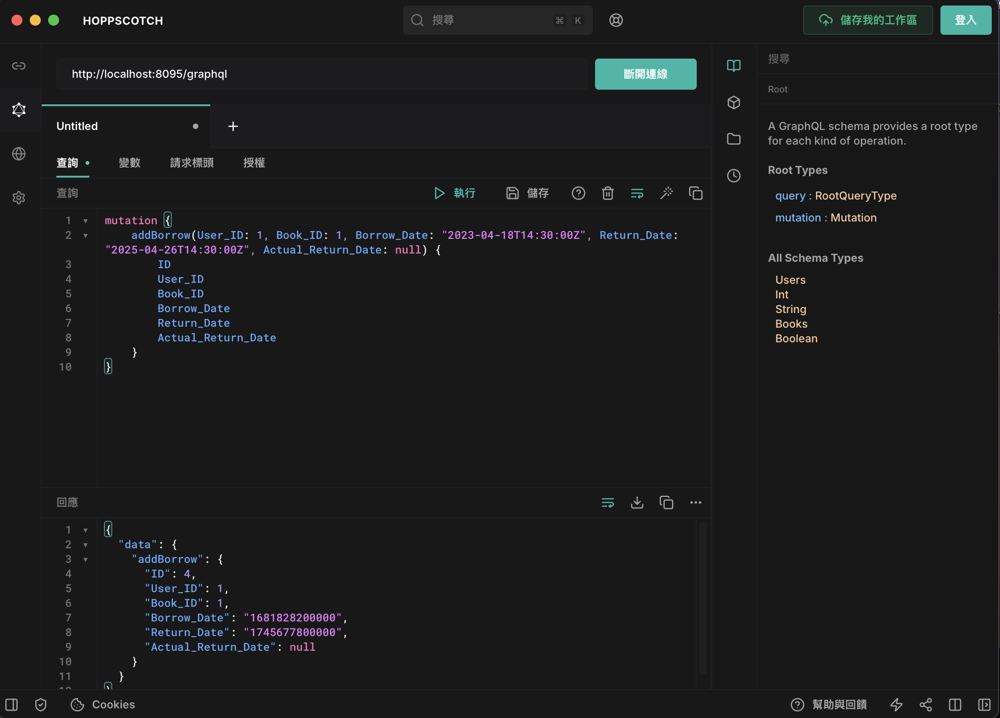

# Backend library management system based on GraphQL

基於Node.js技術打造的GraphQL圖書資訊管理系統後端平台。

## 壹、基本說明
**一、目標：**
這個GraphQL平台旨在為前端提供一套完整的書籍借閱管理後台功能，支持對讀者、書籍、書籍類別及借閱紀錄進行創建、瀏覽、修改及刪除等常見操作。本平台的後端開發基於PostgreSQL、Node.js及相關技術套件，確保系統的穩定性與高效能。

**二、開發環境：**
以下是開發該平台所採用的環境：
* 虛擬機：Docker
* 作業系統：Debian
* 程式語言：JavaScript
* JavaScript執行環境：Node.js
* Node.js資源管理工具：npm
* 資料庫：PostgreSQL
* 程式編輯器：Visual Studio Code

**三、使用相依套件：**
以下是開發該平台所使用的Node.js套件：
* express（Web應用程式架構）
* express-graphql（GraphQL API伺服器）
* graphql（GraphQL套件）
* dotenv（將敏感變數放入環境變數中）
* sequelize（基於Node.js的非同步ORM框架）
  
**四、對於GraphQLI請求：** 
以下是此後端平台提供GraphQL功能，包含對應的http方法、路徑及參數說明，如下所示：
1. `findAllUsers`：查詢所有讀者
2. `findSpecificUsers`：查詢特定讀者
3. `addUser`：新增讀者
4. `updateUser`：更改讀者資訊
5. `deleteUser`：刪除讀者
6. `findSpecificBooksTitle`：查詢特定書籍名稱
7. `findSpecificBooksISBN`：查詢特定書籍ISBN
8. `addBook`：新增書籍
9. `updateBook`：更改書籍資訊
10. `deleteBook`：刪除書籍
11. `findAllCategories`：查詢所有類別
12. `addCategory`：新增類別
13. `updateCategory`：更改類別資訊
14. `deleteCategory`：刪除書籍
15. `findSpecificUserBorrowing`：查詢特定讀者借閱紀錄
16. `findSpecificBookBorrowing`：查詢特定書籍借閱紀錄
17. `addBorrow`：新增借閱紀錄
18. `updateBorrow`：更改借閱紀錄
19. `deleteBorrow`：刪除借閱紀錄

## 貳、操作說明
**ㄧ、安裝程式方式：** 
從GitHub下載檔案，則需先架設程式運行環境，其步驟如下：
  * PostgreSQL
    * 請事先安裝好PostgreSQL，並啟動。在將資料庫帳號postgres，密碼設為123456。
    * 建立資料庫：指令如下：
    ```psql
    CREATE DATABASE lms
    ```
    * 資料表：由於本後端平台使用Sequelize進行資料操作，程式執行過程中會自動將資料物件映射到資料庫，因此無需手動創建資料表。
  * server.js程式碼：請事先安裝好Node.js與NPM，其設定步驟如下：
    * 下載程式碼，並解壓縮。
    * 安裝相依套件
    ```shell
    npm init
    npm install express
    npm install express-graphql
    npm install graphql
    npm install dotenv
    npm install pg
    npm install sequelize
    ```
    * 創建儲存環境變數檔案.env，內容如下：（此檔案務必要於nodejs資料夾中新增，否則將造成平台無法運作）
    ```.env
    DB_HOST=postgres
    DB_PORT=5432
    DB_USER=postgres
    DB_PASSWORD=123456
    DB_NAME=LMS
    ```
    * 啟動伺服器，請執行以下指令啟動伺服器：
    ```shell
    cd 檔案位置/coding/nodejs
    node server.js
    ```
**三、運行程式方式：**
呼叫此後端平台的方式有多種，其中本篇將介紹其中一款常用的API測試工具—Hoppscotch。請從左側工具列切換至GraphQL，然後在查詢選項中輸入以下指令。
<br>
  <div align="center">
  	
  </div>
<br>

1. 查詢所有讀者:
```graphql
query {
    findAllUsers {
        ID
        Name
        Email
        Phone
        Address
        Membership_Date
        Membership_Type
        Status
    }
}
```
2. 查詢特定讀者:
```graphql
query {
    findSpecificUsers(Name: "John Doe", Email: "john@example.com") {
        ID
        Name
        Email
        Phone
        Address
        Membership_Date
        Membership_Type
        Status
    }
}
```
3. 新增讀者:
```graphql
mutation {
    addUser(Name: "John Doe", Email: "john@example.com", Phone: "123-456789", Address: "Wanhua District, Taipei City, Republic of China", Membership_Date: "2025-04-016 11:05:06", Membership_Type: "premium", Status: "active") {
        ID
        Name
        Email
        Phone
        Address
        Membership_Date
        Membership_Type
        Status
    }
}
```
4. 更改讀者資訊:
```graphql
mutation {
    updateUser(ID: 2, Name: "Tom Chen", Email: "Tom@example.com", Phone: "123-987654", Address: "Xinyi District, Taipei City, Republic of China", Membership_Date: "2024-04-01", Membership_Type: "member", Status: "active") {
        ID
        Name
        Email
        Phone
        Address
        Membership_Date
        Membership_Type
        Status
    }
}
```
5. 刪除讀者:
```graphql
mutation {
    deleteUser(ID: 4) {
        ID
    }
}
```
6. 查詢特定書籍名稱:
```graphql
query {
    findSpecificBooksTitle(Title: "Angel Learning") {
        ID
        Title
        Author
        Publisher
        Publication_Date
        ISBN
        Category
        Language
        Pages
        Location
        Copies_Available
        Copies_Borrowed
    }
}
```
7. 查詢特定書籍ISBN:
```graphql
query {
    findSpecificBooksISBN(ISBN: "ISBN 978-1-16-148410-0") {
        ID
        Title
        Author
        Publisher
        Publication_Date
        ISBN
        Category
        Language
        Pages
        Location
        Copies_Available
        Copies_Borrowed
    }
}
```
8. 新增書籍:
```graphql
mutation {
    addBook(Title: "Angel Learning", Author: "Xiaoming Wang", Publisher: "Genius Publishing", Publication_Date: "2024-04-01", ISBN: "ISBN 978-1-16-148410-0", Category: 1, Language: "chinese", Pages: 102, Location: "Republic of China", Copies_Available: 3, Copies_Borrowed: 0) {
        ID
        Title
        Author
        Publisher
        Publication_Date
        ISBN
        Category
        Language
        Pages
        Location
        Copies_Available
        Copies_Borrowed
    }
}
```
9. 更改書籍資訊:
```graphql
mutation {
    updateBook(ID: 1, Title: "Angel Learning", Author: "Xiaoming Wang", Publisher: "Genius Publishing", Publication_Date: "2024-04-01", ISBN: "ISBN 978-1-16-148410-0", Category: 1, Language: "chinese", Pages: 102, Location: "Republic of China", Copies_Available: 3, Copies_Borrowed: 1) {
        ID
        Title
        Author
        Publisher
        Publication_Date
        ISBN
        Category
        Language
        Pages
        Location
        Copies_Available
        Copies_Borrowed
    }
}
```
10. 刪除書籍:
```graphql
mutation {
    deleteBook(ID: 1) {
        ID
    }
}
```
11. 查詢所有類別:
```graphql
query {
    findAllCategories {
        ID
        Name
        Description
    }
}
```
12. 新增類別:
```graphql
mutation {
    addCategory(Name: "Science Fiction", Description: "Science fiction is a genre of fiction that explores imaginative and futuristic concepts, often based on science and technology.") {
        ID
        Name
        Description
    }
}
```
13. 更改類別資訊:
```graphql
mutation {
    updateCategory(ID: 1, Name: "Science Fiction", Description: "Science fiction is a genre of fiction that explores imaginative and futuristic concepts, often based on science and technology.") {
        ID
        Name
        Description
    }
}
```
14. 刪除書籍:
```graphql
mutation {
    deleteCategory(ID: 1) {
        ID
    }
}
```
15. 查詢特定讀者借閱紀錄:
```graphql
query {
    findSpecificUserBorrowing(User_ID: 1) {
      	ID
        User_ID
        Book_ID
        Borrow_Date
        Return_Date
        Actual_Return_Date
    }
}
```
16. 查詢特定書籍借閱紀錄:
```graphql
query {
    findSpecificBookBorrowing(Book_ID: 1) {
      	ID
        User_ID
        Book_ID
        Borrow_Date
        Return_Date
        Actual_Return_Date
    }
}
```
17. 新增借閱紀錄:
```graphql
mutation {
    addBorrow(User_ID: 1, Book_ID: 1, Borrow_Date: "2023-04-18", Return_Date: "2025-04-26", Actual_Return_Date: null) {
      	ID
        User_ID
        Book_ID
        Borrow_Date
        Return_Date
        Actual_Return_Date
    }
}
```
18. 更改借閱紀錄:
```graphql
mutation {
    updateBorrow(ID: 1, User_ID: 1, Book_ID: 1, Borrow_Date: "2023-04-18", Return_Date: "2025-04-26", Actual_Return_Date: "2025-04-20") {
      	ID
        User_ID
        Book_ID
        Borrow_Date
        Return_Date
        Actual_Return_Date
    }
}
```
19. 刪除借閱紀錄:
```graphql
mutation {
    deleteBorrow(ID: 2) {
        ID
    }
}
```
